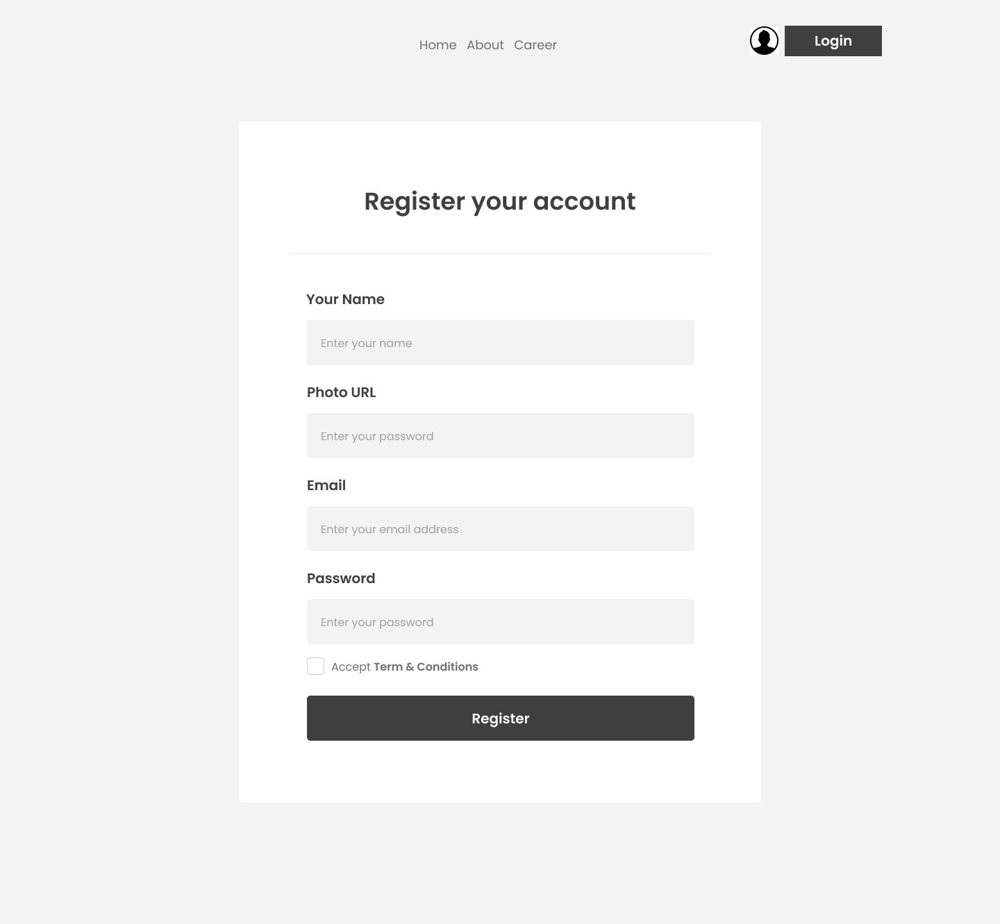
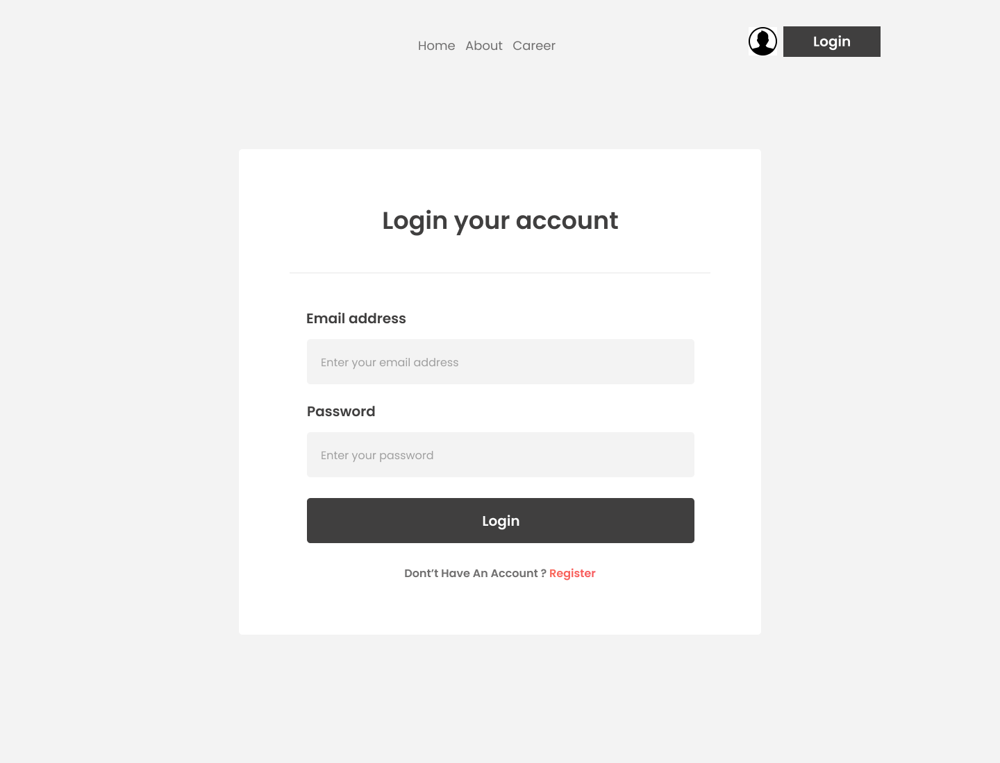

# 📰 The Dragon News

**Live Site:** [the-dragon-news-366c4.web.app](https://the-dragon-news-366c4.web.app)

Dragon News is a modern news portal web app built with **React.js** and **Firebase Authentication**, featuring a clean UI and responsive design.

---

## 🚀 Features
- 🔐 User Authentication (Email/Password, Google, GitHub login)
- 📰 News categorized by topics
- ⭐ Trending and featured news section
- 📱 Fully responsive (mobile, tablet, desktop)
- 🔒 Protected routes for authenticated users
- 🎨 Styled with Tailwind CSS & DaisyUI

---

## 🛠️ Tech Stack
- **React.js**
- **React Router DOM**
- **Firebase Authentication**
- **Tailwind CSS + DaisyUI**

---

## 📂 Project Screenshot

